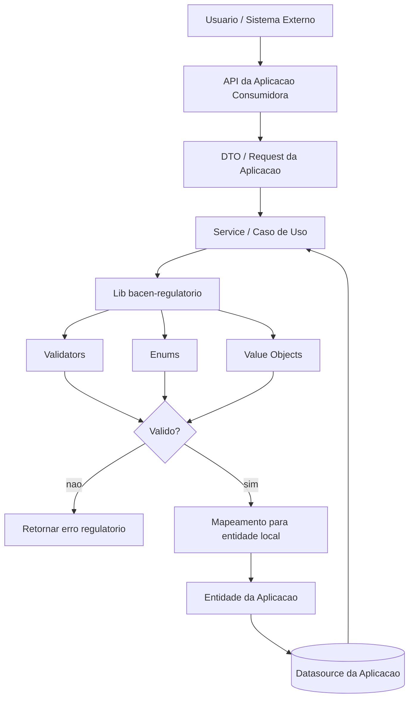

# bacen-regulatorio

> Implementacoes minimas e validacao de regras regulatorias do Banco Central do Brasil por dominio normativo.

[](https://github.com/odevpedro/bacen_regulatorio/actions)

---

## Sobre o Projeto

Repositorio wiki + codigo que documenta e implementa as principais regras dos dominios regulatorios do Banco Central do Brasil relevantes para engenharia de software em fintechs e bancos. Cada dominio e um modulo Maven independente com enums, value objects, validators e testes que servem como documentacao executavel das normas.

Nao e uma implementacao de sistema completo — e uma base de consulta e ponto de partida para novos projetos.

---

## Stack

| Item | Tecnologia |
|------|-----------|
| Runtime | Java 21 |
| Build | Maven multi-modulo (10 modulos) |
| Testes | JUnit 5 + AssertJ |
| CI/CD | GitHub Actions |
| Publicacao | GitHub Packages |

Sem Spring Boot — puro Java, sem framework, para maxima portabilidade.

As evidencias normativas ficam organizadas em `docs/evidencias/`, com um indice central
e uma pagina por modulo apontando para os endpoints oficiais usados como base de cada regra.

---

## Estrutura

```
bacen_regulatorio/
├── pom.xml                              (parent BOM com gestao de versoes)
├── README.md
├── backlog.md
├── .github/workflows/
│   ├── maven.yml                        (CI: build + testes)
│   └── publish.yml                      (publicacao no GitHub Packages)
├── docs/
│   ├── system-feature-flows.md
│   ├── data-model.md
│   └── evidencias/                    (PDFs oficiais e indice por dominio)
└── dominios/
    ├── commons/                         (utilitarios compartilhados entre dominios)
    ├── recebiveis-cartao/               (Res. 4.734, Circ. 3.952, 4.016, Res. BCB 264)
    ├── pix/                             (Res. BCB 1, 142, 191)
    ├── open-finance/                    (Res. BCB 32, 57, 316)
    ├── arranjos-pagamento/             (Res. CMN 4.282, Res. BCB 150)
    └── pld-ft/                          (Circ. 3.978, Res. BCB 277)
```

---

## Mapa de Cobertura

| Dominio | Normas | Enums | Validators | Value Objects | Testes | Exemplos |
|---------|--------|-------|-----------|--------------|--------|---------|
| Commons | — | — | 1 | — | 12 | — |
| Recebiveis de Cartao | 4 | 4 | 3 | 3 | 17 | 4 JSON |
| PIX | 6 | 5 | 6 | 5 | 41 | 3 JSON |
| Open Finance | 4 | 4 | 1 | 1 | 12 | 2 JSON |
| Arranjos de Pagamento | 3 | 2 | 1 | — | 10 | 1 JSON |
| PLD/FT | 3 | 3 | 3 | 1 | 16 | 1 JSON |
| Cambio | 2 | 4 | 1 | 2 | 9 | — |
| Credito | 2 | 4 | 1 | 2 | 8 | — |
| SPB | 1 | 3 | 1 | 1 | 7 | — |
| DREX | 1 | 3 | 1 | 2 | 7 | — |
| **Total** | **26** | **32** | **18** | **17** | **139** | **14 JSON** |

---

## Modulos

### Commons

Utilitarios compartilhados entre dominios: validacao de CPF e CNPJ com algoritmos de digito verificador.

### Recebiveis de Cartao

Regras para negociacao de recebiveis conforme o marco regulatorio de 2019. Inclui: unidade de recebivel, gravames, prioridade, saldo, interoperabilidade, CPF/CNPJ.

- [README](dominios/recebiveis-cartao/README.md)
- [Normas](dominios/recebiveis-cartao/docs/normas.md)
- [Exemplos JSON](dominios/recebiveis-cartao/exemplos/)

### PIX

Regras do arranjo de pagamento instantaneo: validacao de chaves DICT (CPF, CNPJ, EMAIL, TELEFONE, EVP), limites noturnos, tipos de operacao, motivos de devolucao, validacao de End-to-End ID (formato E{ISPB}{data}{hora}{sequencial}), txid (26-35 chars alfanumericos) e payload QR Code EMVCo.

- [README](dominios/pix/README.md)
- [Normas](dominios/pix/docs/normas.md)
- [Exemplos JSON](dominios/pix/exemplos/)

### Open Finance

Ciclo de vida de consentimento, permissoes granulares e dependencias hierarquicas entre escopos (Res. BCB 32).

- [README](dominios/open-finance/README.md)
- [Normas](dominios/open-finance/docs/normas.md)
- [Exemplos JSON](dominios/open-finance/exemplos/)

### Arranjos de Pagamento

Catalogo de codigos SPB (VCC, MCC, ECC, PIX etc.), papeis dos participantes e criterios de elegibilidade.

- [README](dominios/arranjos-pagamento/README.md)
- [Normas](dominios/arranjos-pagamento/docs/normas.md)
- [Exemplos JSON](dominios/arranjos-pagamento/exemplos/)

### PLD/FT

Monitoramento de operacoes atipicas, perfil de risco KYC, deteccao de fracionamento suspeito e regras de comunicacao ao COAF.

- [README](dominios/pld-ft/README.md)
- [Normas](dominios/pld-ft/docs/normas.md)
- [Exemplos JSON](dominios/pld-ft/exemplos/)

---

## Como usar

### Como dependencia Maven

```xml
<dependency>
    <groupId>com.bacen.regulatorio</groupId>
    <artifactId>bacen-regulatorio-pix</artifactId>
    <version>1.1.0</version>
</dependency>
```

Repositorio: `https://maven.pkg.github.com/odevpedro/bacen_regulatorio`

### Uso na pratica



Nesse fluxo:

- a aplicacao consumidora continua dono da API, persistencia e integracoes;
- a lib centraliza as regras regulatorias e os modelos canonicos de validacao;
- o mapeamento para entidades e tabelas locais continua sendo responsabilidade da aplicacao.

### Build completo

```bash
mvn clean test
```

### Build de um dominio especifico

```bash
mvn clean test -pl dominios/pix
```

---

## Convencoes do Repositorio

- Cada validator usa `Optional<T>` para erros — sem excecoes nos validadores puros
- Enums tem javadoc com referencia ao artigo da norma
- Value objects validam no construtor e sao imutaveis (records Java 21)
- Testes tem `@DisplayName` com o nome da norma e o comportamento esperado
- Codigo compartilhado entre dominios fica no modulo `commons`

---

## Como contribuir com um novo dominio

1. Criar pasta `dominios/{nome}/` com `pom.xml` herdando do parent
2. Criar `docs/normas.md` com tabela de normas, conceitos e fluxos
3. Criar enums com javadoc referenciando artigos da norma
4. Criar validators retornando `Optional<String>` ou `Optional<MotivoRecusa>`
5. Criar value objects como records Java 21
6. Criar testes com `@DisplayName` no formato `Norma — comportamento esperado`
7. Criar exemplos JSON em `exemplos/`
8. Adicionar o modulo no `pom.xml` raiz
9. Atualizar o mapa de cobertura neste README
